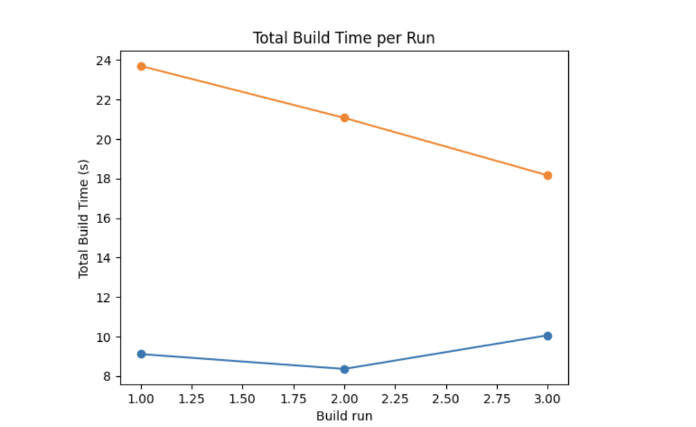

# Kotlin-Spring-MongoDB benchmark embedded (Flapdoodle) vs testcontainers

This project tests performance of popular methods for testing MongoDB integrations.

---

## Consist of
- Kotlin (JDK 21)
- Spring (3.5.10-SNAPSHOT)
- MongoDB (7.0)

## Usage

If you want to test without cache:
```bash
sh ./benchmark-with-cleaning.sh
```

If you want to test quickly:
```bash
sh ./benchmark.sh
```

Result:
```text
./build/reports/profile/flapdoodle-profile.html
./build/reports/profile/testcontainers-profile.html
```
## Metrics

### Environment

- Chip - Apple M4 Pro
- RAM - 24 ГБ
- OS - 26.2 (25C56)

### Flapdoodle

| Run | Total Build Time (s) | Startup (s) | Settings & buildSrc (s) | Loading Projects (s) | Configuring Projects (s) | Artifact Transforms (s) | Task Execution (s) |
| --: | -------------------: | ----------: | ----------------------: | -------------------: | -----------------------: | ----------------------: | -----------------: |
|   1 |                9.105 |       0.287 |                   0.011 |                0.001 |                    0.027 |                   0.000 |              8.597 |
|   2 |                8.353 |       0.290 |                   0.006 |                0.001 |                    0.023 |                   0.000 |              7.891 |
|   3 |               10.058 |       0.286 |                   0.005 |                0.001 |                    0.019 |                   0.000 |              9.582 |

- Build times are stable across runs, ranging from approximately **8.3s to 10.1s**.

- No clear performance trend is observed; variations between runs are minor.

- As expected, **Task Execution** accounts for the majority of the build time, while startup and configuration phases are negligible.

### Testcontainers

| Run | Total Build Time (s) | Startup (s) | Settings & buildSrc (s) | Loading Projects (s) | Configuring Projects (s) | Artifact Transforms (s) | Task Execution (s) |
| --: | -------------------: | ----------: | ----------------------: | -------------------: | -----------------------: | ----------------------: | -----------------: |
|   1 |               23.702 |       0.263 |                   0.005 |                0.001 |                    0.024 |                   0.000 |             23.245 |
|   2 |               21.072 |       0.275 |                   0.007 |                0.001 |                    0.026 |                   0.000 |             20.607 |
|   3 |               18.156 |       0.274 |                   0.005 |                0.000 |                    0.021 |                   0.000 |             17.694 |

- A clear downward trend in build time is visible across runs: **~23.7s → 21.1s → 18.2s**.

- This improvement is most likely caused by warm-up effects such as Docker image caching, Gradle caches, and filesystem cache reuse.

- Despite the improvement, Testcontainers remains approximately **2–2.5× slower** than Flapdoodle in total build time.

### Overall Conclusion

- **Flapdoodle** provides consistently fast and predictable build performance.

- **Testcontainers** benefits significantly from warm-up but still introduces a noticeable overhead compared to Flapdoodle.

- For scenarios where build speed and feedback loop time are critical, Flapdoodle demonstrates a clear advantage.


